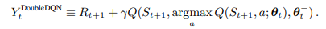
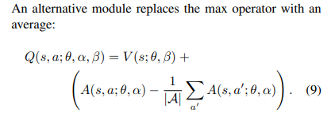

# 简介

Rainbow 是Deepmind提出的一种在DQN基础上融合了6个改进的深度强化学习方法.

六个改进分别为:
+ Double Q-learning
+ Prioritized replay
+ Dueling networks
+ Multi-step learning
+ Distribuitional RL
+ Noisy Nets

Paper: https://www.aminer.cn/pub/5a260c8117c44a4ba8a30ecc/rainbow-combining-improvements-in-deep-reinforcement-learning

## Inital DQN

 
Paper: https://www.aminer.cn/pub/53e9a682b7602d9702fb756d/playing-atari-with-deep-reinforcement-learning

## Double Q-learning
Paper: https://www.aminer.cn/pub/5736960b6e3b12023e51e3ea/deep-reinforcement-learning-with-double-q-learning

Although not fully decoupled, the target network in the DQN architecture provides
a natural candidate for the second value function, without
having to introduce additional networks. We therefore propose to evaluate the greedy policy according to the online
network, but using the target network to estimate its value.
In reference to both Double Q-learning and DQN, we refer
to the resulting algorithm as Double DQN. 
 

## Prioritzed replay

Paper: https://www.aminer.cn/pub/5736960a6e3b12023e51d492/prioritized-experience-replay

proportional prioritization & rank-based prioritization

 

## Dueling networks

Paper: https://arxiv.org/pdf/1511.06581.pdf
 
 max operator or min operator on advantage head to address the issue of identiability

 

## Multi-step learning

Using multi-step TD for better target update.

## Distributional RL

Paper: https://www.aminer.cn/pub/599c7b58601a182cd272b540/a-distributional-perspective-on-reinforcement-learning

 

## Noisy Nets

Paper: https://www.aminer.cn/pub/599c795b601a182cd2633fe1/noisy-networks-for-exploration

Independent Gaussian noise
Factorised Gaussian noise

 

extra noise sampling for Dueling DQN

# Comparison and Ablation Study

Comparison Study

 

Ablation Study

 

multi-step & priority matter most in ablation study!