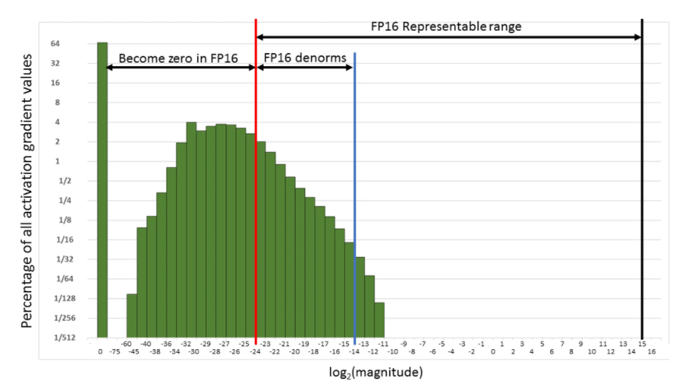
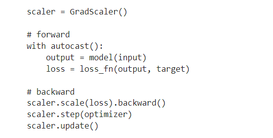
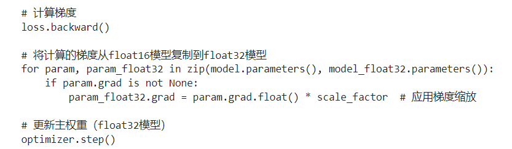

# fp32, fp16 & bf16

$$fp = -1^{sign}*(1.0+fraction)*2^{exponent-15}$$

BF16 and FP32 has same digits of exponent(8 bit)

FP16 has 5-bit expoenent

# load in 8-bit

ln1,ln2 weight & bias: float16 

attention weight: torch.int8, bias:torch.float16

mlp weight:torch.int8, bias:torch.float16

# situations that needs fp32

 reductions, exponentiation

 large + small: weight upadtes, reductions again

 + 1+0.0001

 + $update/para < 2^{-11} (0.00049),$ no effect

# AMP

# loss scaling
using $scaler = GradScaler()$

+ 针对的是 loss (loss scaling)
  - small gradients may underflow in FP16 regions of the network
  - scaling the loss brings gradients into the FP16 dynamic range
  - unscale gradients in FP32 for *optimizer.step()*
  
   

