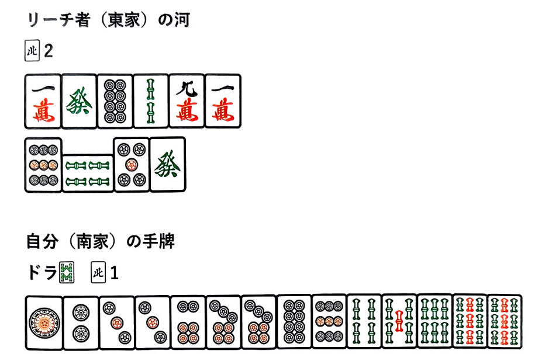

# 第三章 攻守判断

## 1. 攻守判断

接下来将为大家讲解攻守判断(攻防决策)。首先需要明确的是，三麻的攻守判断与四麻存在显著差异。即便是同为三人麻将，规则不同战术也会随之改变。本书所述的攻守判断均基于《雀魂》《天凤》《麻雀一番街》的规则体系，请读者以此为前提进行理解。正如开篇所述，在数值化三麻攻守判断上，《数据制胜三人麻将》已取得丰硕研究成果。本书将以该数据为基础，进一步提炼出更具实战价值的攻防战术进行讲解。

### 放铳率与攻守判断的关系

在正式讲解攻防战术之前，首先需要理解放铳率的概念。或许有人会问：“放铳率和攻防策略之间到底有什么关系？”

举个例子，假设遇到以下立直（リーチ）​局面时：

在这种情况下，如果切出3P，即可形成平和宝牌1的听牌。然而，关于此时该进攻还是防守的判断，存在一个基准：​​“当放铳率为○○%时，门前良形听牌且打点超过○○点即可选择进攻”​**。

换言之，只要知道即将打出的3P的放铳率，就能得出攻防策略的明确答案。